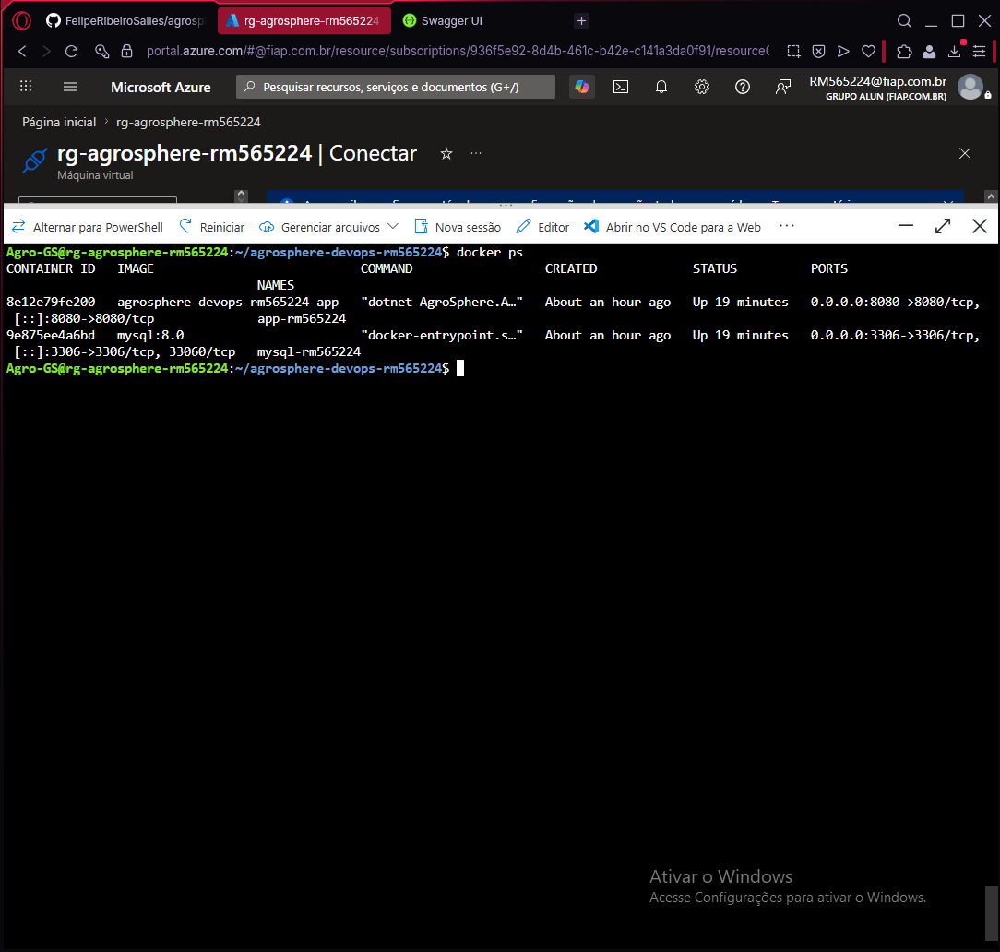
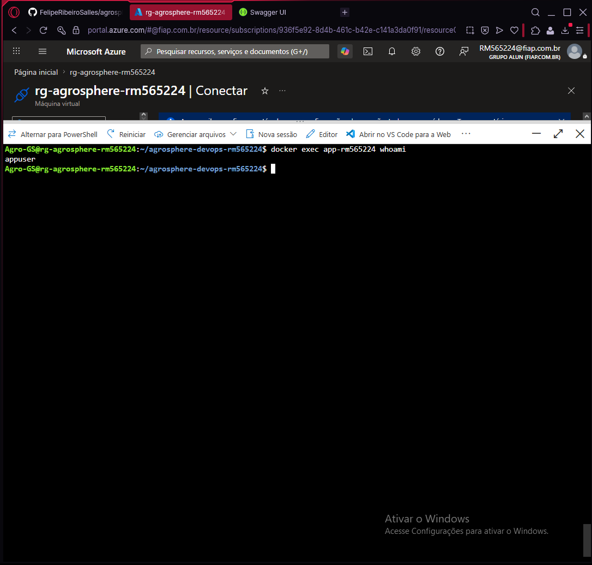
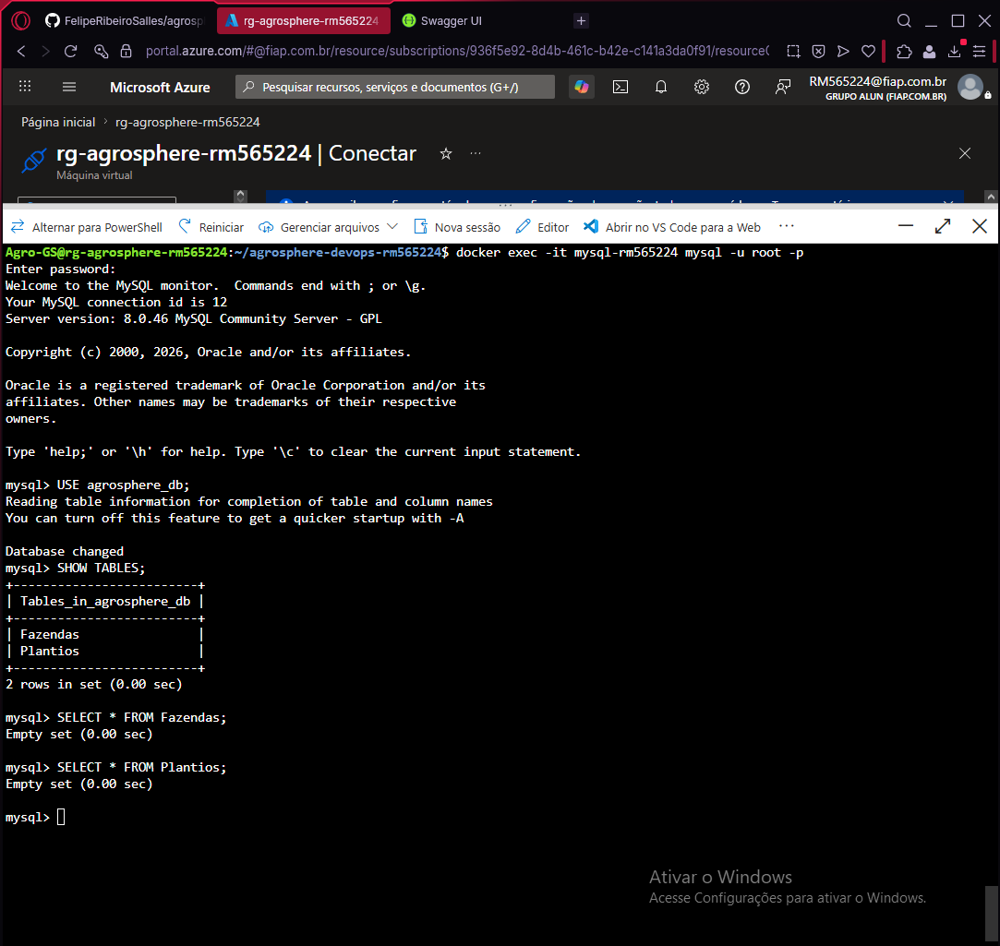
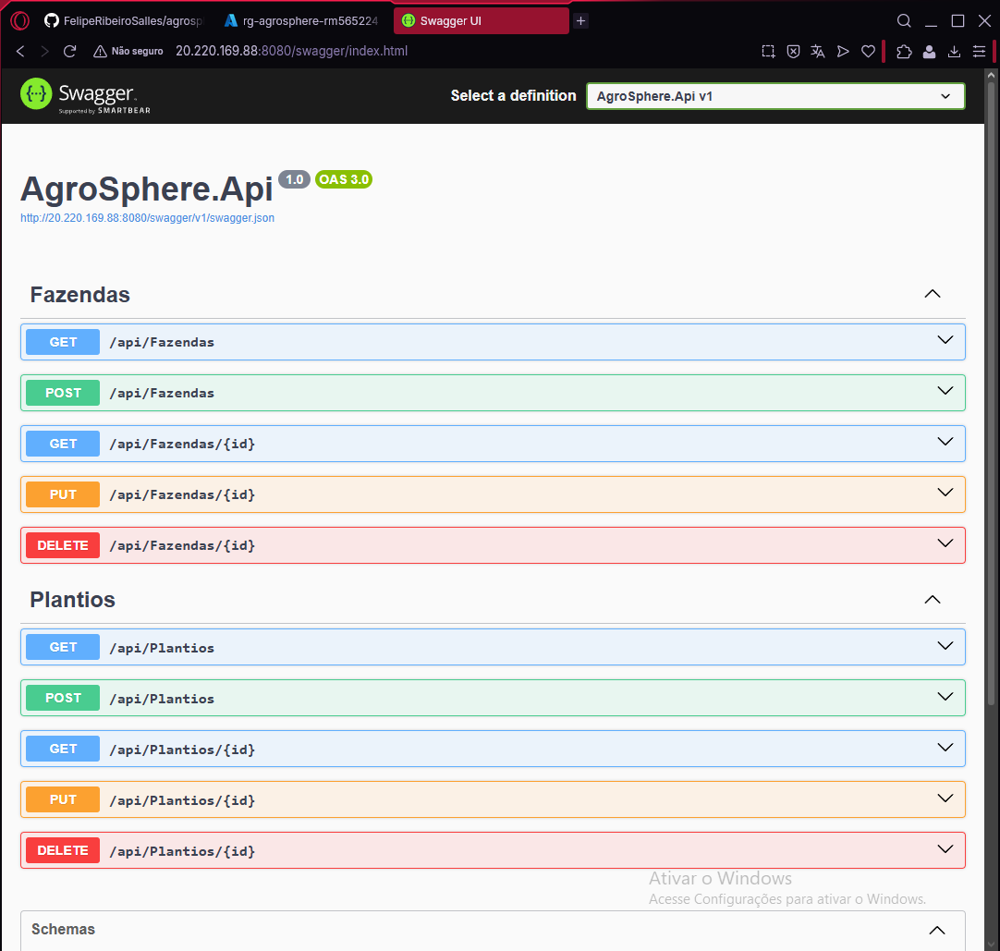
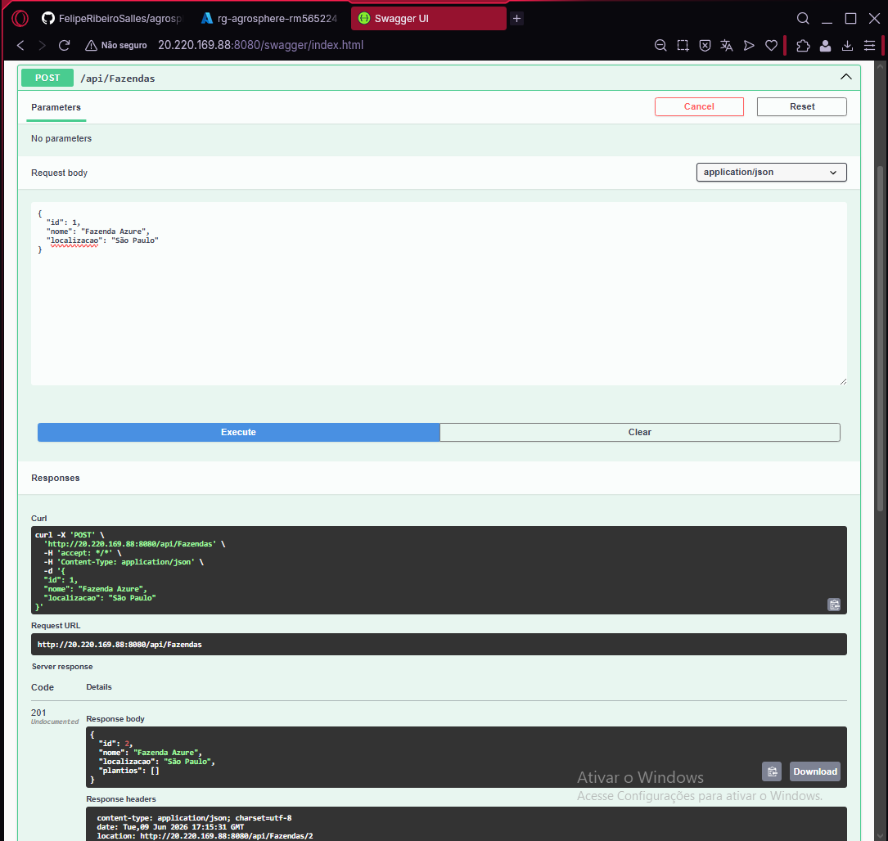
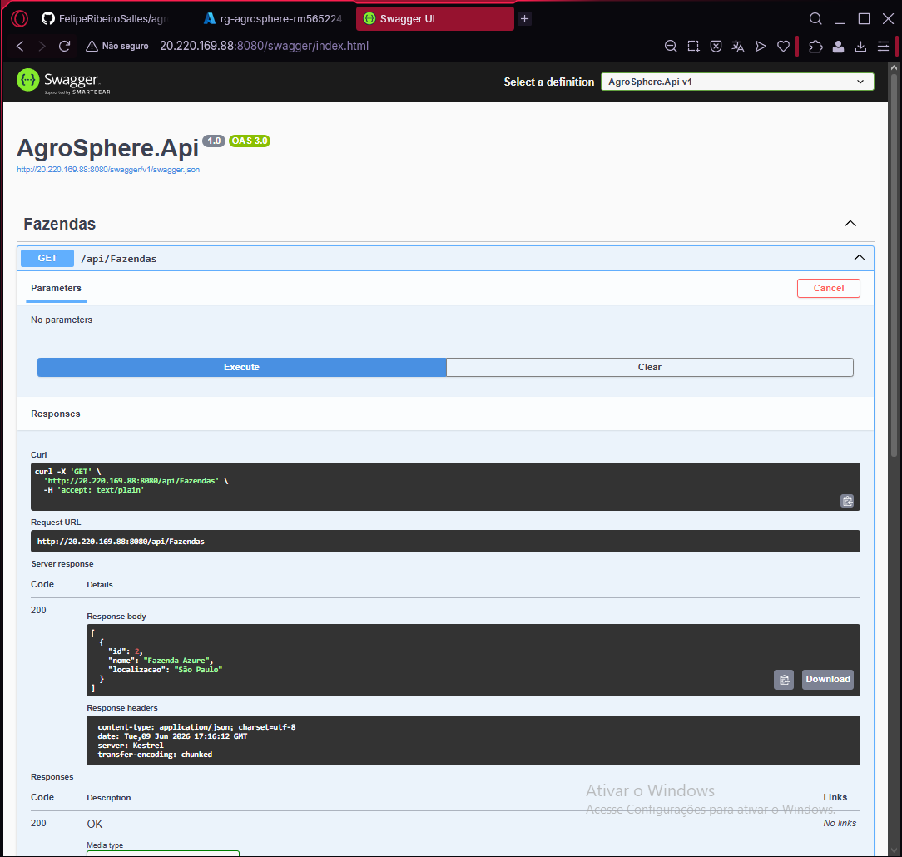
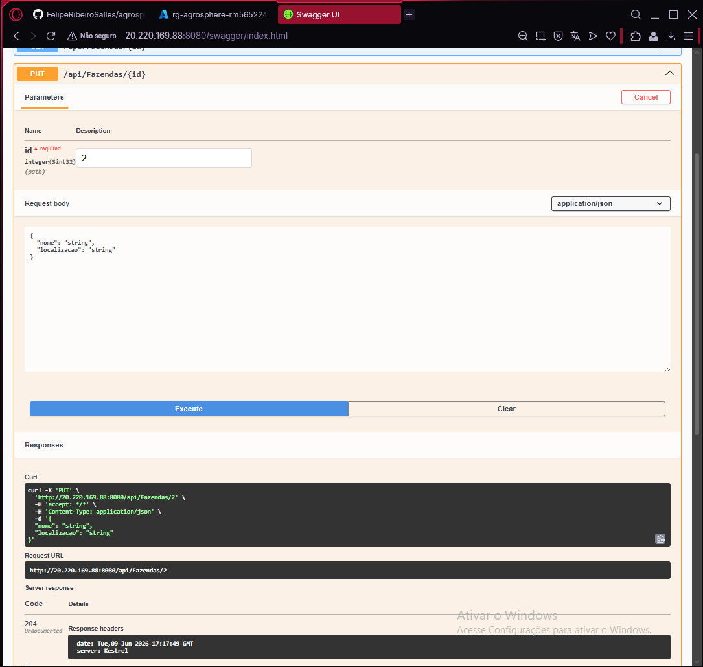
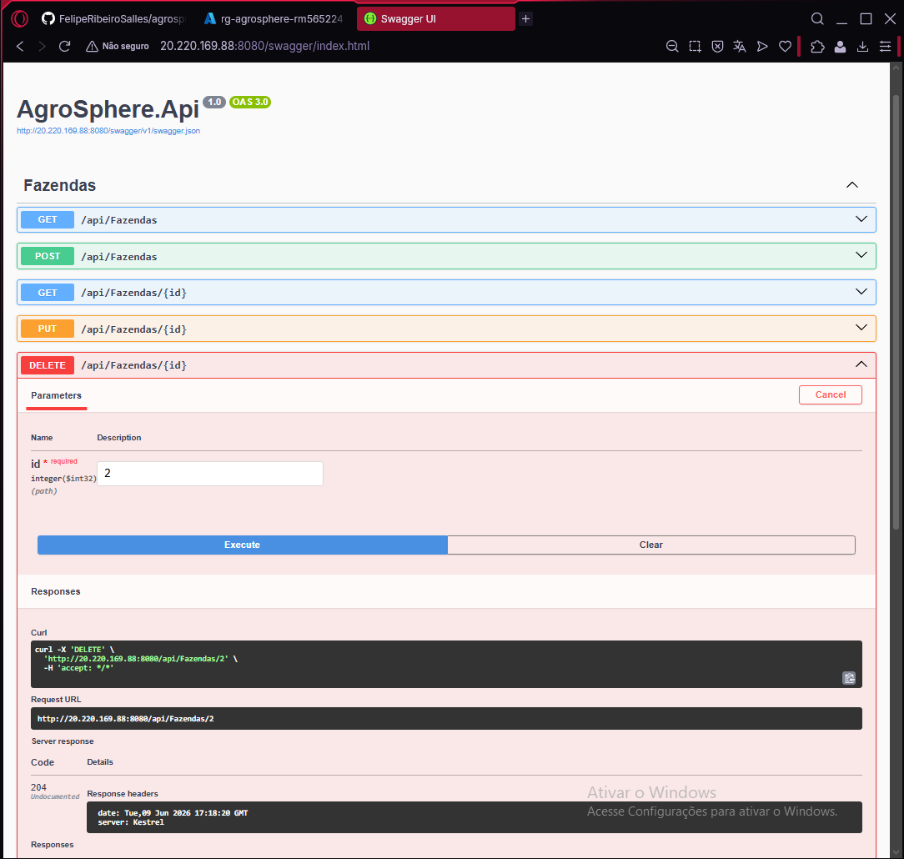
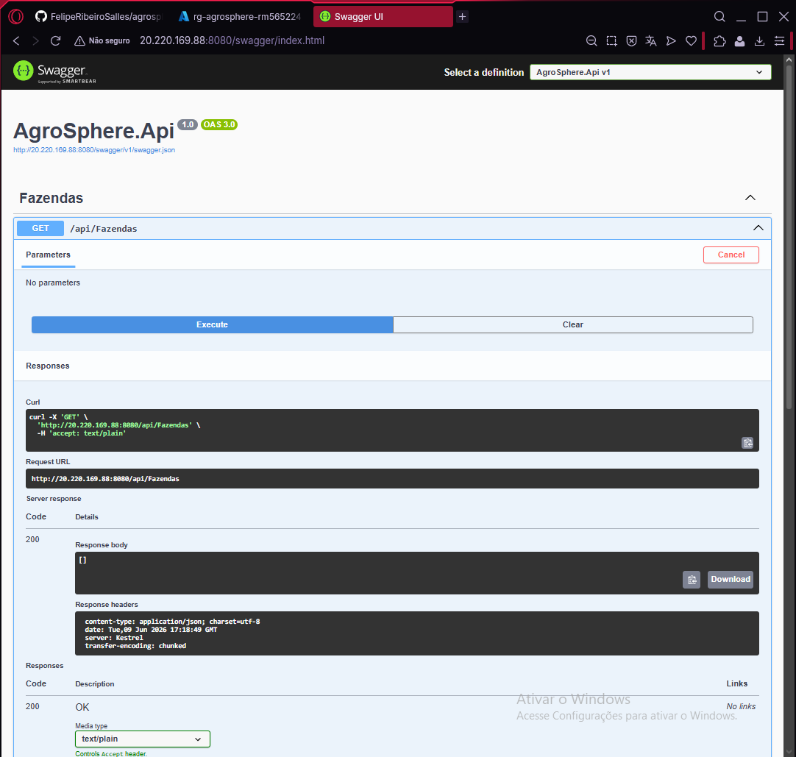

# 🌱 AgroSphere API

API REST desenvolvida em .NET para gerenciamento de Fazendas e Plantios, utilizando Docker, MySQL e hospedagem em máquina virtual Azure.

---

# 👨‍💻 Integrantes


- Felipe Ribeiro Salles de Camargo RM: 565224
- João Victor Santana dos Santos RM: 566063
- Nome RM

---

# 📌 Objetivo do Projeto

O AgroSphere é uma solução desenvolvida para auxiliar no gerenciamento agrícola, permitindo o cadastro e gerenciamento de:

- Fazendas
- Plantios

A aplicação foi desenvolvida utilizando arquitetura baseada em API REST, conteinerização com Docker e banco de dados MySQL.

---

# 🛠️ Tecnologias Utilizadas

- .NET 8
- ASP.NET Core
- Entity Framework Core
- MySQL 8
- Docker
- Docker Compose
- Swagger
- Azure VM
- Linux Ubuntu

---

# 🏗️ Arquitetura da Solução

A solução foi estruturada da seguinte forma:

- Container da aplicação ASP.NET Core
- Container MySQL
- Comunicação via Docker Network
- Persistência de dados no MySQL
- Publicação em VM Azure

---

# ☁️ Infraestrutura Azure

A aplicação foi hospedada em uma Máquina Virtual Linux no Microsoft Azure.

## Recursos utilizados

- Azure Virtual Machine
- Docker Engine
- Docker Compose
- Porta 8080 liberada via NSG

---

# 🐳 Containers em Execução

## Containers ativos via Docker



---

# 🔐 Segurança

A aplicação NÃO está sendo executada com usuário root.

## Verificação do usuário da aplicação



---

# 🗄️ Banco de Dados

Banco MySQL executando em container Docker.

## Estrutura das tabelas

- Fazendas
- Plantios

## Verificação do banco



---

# 🚀 How To Execute

## 📋 Pré-requisitos

Antes de iniciar o projeto, é necessário possuir instalado:

- Docker
- Docker Compose
- Git
- Conta Microsoft Azure
- Máquina Virtual Linux Ubuntu

---

# 🧰 1️⃣ Clonar o Repositório

```bash
git clone <LINK-DO-REPOSITORIO>
```

---

# 📂 2️⃣ Entrar na Pasta do Projeto

```bash
cd agrosphere-devops
```

---

# 🐳 3️⃣ Subir os Containers

Execute o comando abaixo para construir e iniciar os containers:

```bash
docker compose up -d --build
```

---

# 🔎 4️⃣ Verificar Containers

Para validar se os containers estão em execução:

```bash
docker ps
```

Resultado esperado:

- Container da API rodando
- Container MySQL rodando

---

# ☁️ 5️⃣ Configuração da Azure VM

## Liberar Porta 8080

No Network Security Group (NSG):

- Porta: 8080
- Protocolo: TCP
- Ação: Allow

---

# 🌐 6️⃣ Acessar Swagger

Após subir os containers:

```txt
http://IP-DA-VM:8080/swagger
```

Exemplo:

```txt
http://20.220.169.88:8080/swagger
```

---

# 🗄️ 7️⃣ Acessar Banco de Dados MySQL

Entrar no container MySQL:

```bash
docker exec -it mysql-rm565224 mysql -u root -p
```

Selecionar database:

```sql
USE agrosphere_db;
```

Listar tabelas:

```sql
SHOW TABLES;
```

Consultar dados:

```sql
SELECT * FROM Fazendas;
SELECT * FROM Plantios;
```

---

# 🔐 8️⃣ Validar Usuário Não Root

Executar:

```bash
docker exec app-rm565224 whoami
```

Resultado esperado:

```txt
appuser
```

---

# 📡 9️⃣ Testar Endpoints no Swagger

## CREATE

Endpoint:

```txt
POST /api/Fazendas
```

JSON:

```json
{
  "id": 1,
  "nome": "Fazenda Azure",
  "localizacao": "São Paulo"
}
```

---

## READ

Endpoint:

```txt
GET /api/Fazendas
```

---

## UPDATE

Endpoint:

```txt
PUT /api/Fazendas/{id}
```

JSON:

```json
{
  "nome": "Fazenda Atualizada",
  "localizacao": "Campinas"
}
```

---

## DELETE

Endpoint:

```txt
DELETE /api/Fazendas/{id}
```

---

# 📡 Swagger da API

## Swagger Online

A API pode ser acessada via:

> http://20.220.169.88:8080/swagger/index.html

---

# 📷 Evidências do CRUD

## Swagger Completo



---

# ✅ CREATE - POST

Cadastro de fazenda realizado com sucesso.



---

# ✅ READ - GET

Consulta de fazendas cadastradas.



---

# ✅ UPDATE - PUT

Atualização de fazenda realizada com sucesso.



---

# ✅ DELETE - DELETE

Remoção de fazenda realizada com sucesso.



---

# ✅ GET FINAL

Validação final demonstrando lista vazia após exclusão.



---

# 🧪 Endpoints Disponíveis

## Fazendas

- GET /api/Fazendas
- POST /api/Fazendas
- GET /api/Fazendas/{id}
- PUT /api/Fazendas/{id}
- DELETE /api/Fazendas/{id}

---

## Plantios

- GET /api/Plantios
- POST /api/Plantios
- GET /api/Plantios/{id}
- PUT /api/Plantios/{id}
- DELETE /api/Plantios/{id}

---

# 📦 Estrutura Docker

## Serviços

- app
- mysql

## Portas

| Serviço | Porta |
|---|---|
| API | 8080 |
| MySQL | 3306 |

---

# 📁 Estrutura do Projeto

```txt
AgroSphere.Api/
│
├── Controllers/
├── Models/
├── DTOs/
├── Data/
├── Dockerfile
├── docker-compose.yml
└── Program.cs
```
